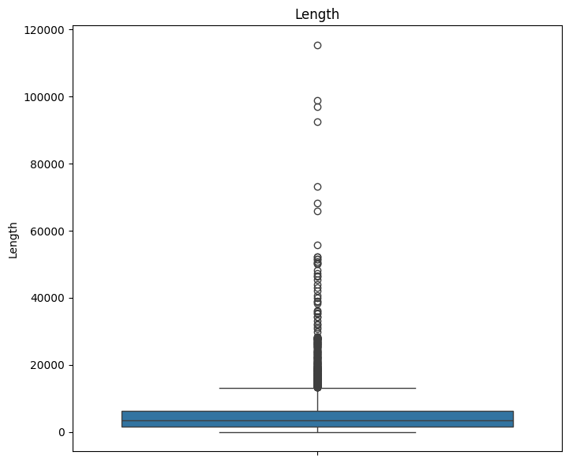
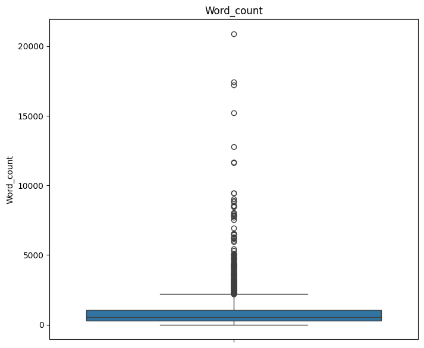
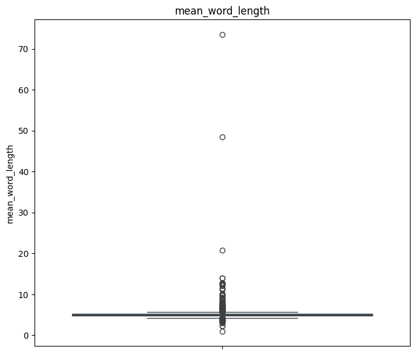
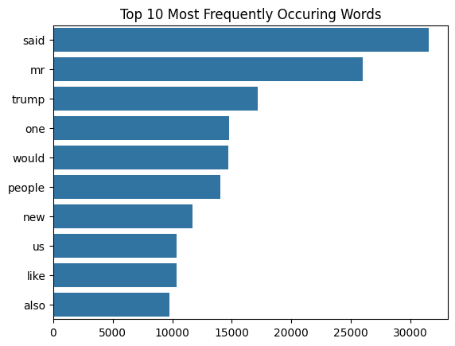

# Fake News Analysis

## Introduction

Fake news articles have become rampant over the years leading to misinformation. Performing an analysis and modelling on news articles will help ensure more accurate news articles are spread. The project will be focused on building models that can help predict whether a news article is real or fake.

## Problem Statement

The manager of our online news agency has tasked me with creating a predictve model that can predict whether a news article is fake or real.

To accomplish this I will build a classifier that can help with the prediction. This will help the agency perform an analysis of submitted articles to help find false news before publication.

## Objectives

My top objectives for modelling will be:

1. Determine the best model to predict fake news.
2. Build a model that can predict fake news with an accuracy 0f 90% or above.

## Data sources

The data for this analysis was obtained from kaggle.

The dataset can be viewed by clicking the following link: <a href="https://www.kaggle.com/competitions/fake-news/data?select=train.csv" target="_blank">Fake News Dataset </a>

The dataset contains the following columns:

- **id**: This is the unique identifier of the news article.
- **title**: The title of the news article
- **author**: The person who wrote the article.
- **text**: The details of the news article.
- **label**: The output with 1 as real article and 0 as fake article

## Data Understanding

Key Questions for Data Understanding:

- What is the shape of the dataset.

- Are there missing values in the dataset.

- What are the datatypes of the columns.

- Are there duplicates in the dataset.

## Analysis and Modelling

The analysis included calculating some properties of the text including:

- Character counts
- word count
- mean word length
- mean sentence length.

Bigrams and trigrams of the text are also calculated by first using a countVectorizer then dispalying the feature names out to show the text.

### Modelling

The models employed in this analysis include multinomialNb, long short-term memory(LSTM) and bidirectional LSTM.

Model Comparison: The performance of the models is compared based on accuracy to identify the best-performing model.

## Visualizations

The following visualizations are included in this analysis:

Box plot of average length of sentenses

Box plot of word counts in the articles

Box plot of mean word length

Top 10 most frequently occuring words

## Requirements

The environment.txt shows the requirements required.

## Usage

Create a new environment with the required packages in environment.txt.

- Run the data preprocessing steps to handle missing values and duplicates. Perform exploratory data analysis to gain insights into the dataset. Build and train different models (multinomialNB, LSTM and bidirectional LSTM models) using appropriate evaluation metrics. Compare the performance of the models and select the best-performing model.

## Conclusion

- The analysis and modelling employed a **multinomialNB** model, **long short-term memory** and **bidirectional LSTM** model. The model was trained and evaluated on a dataset of 8000 rows.

- The **best performing** model was the **multinomialNB**. The model achieved an accuracy of 92% with a precision of .88 for class 0 and .96 for class 1. It was also able to recall 96% of class 0 and 87% of class 1 correctly. The relatively high accuracy and balanced performance on both classes indicate that the model is well tuned and robust.

## Recommendations

- Despite the model achieving a good accuracy score of 92%, **more data** should be collected to help improve the model.

- Consider **transformer-based models** trained on vast datasets to improve performance over more traditional models.

## Suggestions for future improvement

- Implement **advanced models** such as BERT (Bidirectional Encoder Representations from Transformers) for context understanding and content validation.

- Build **knowledge graphs** from trusted databases (e.g., Wikipedia) to validate facts mentioned in articles and verify claims in real time.

- Implement **sentiment analysis** to detect patterns in text that are more common in fake news (such extreme opinions).
